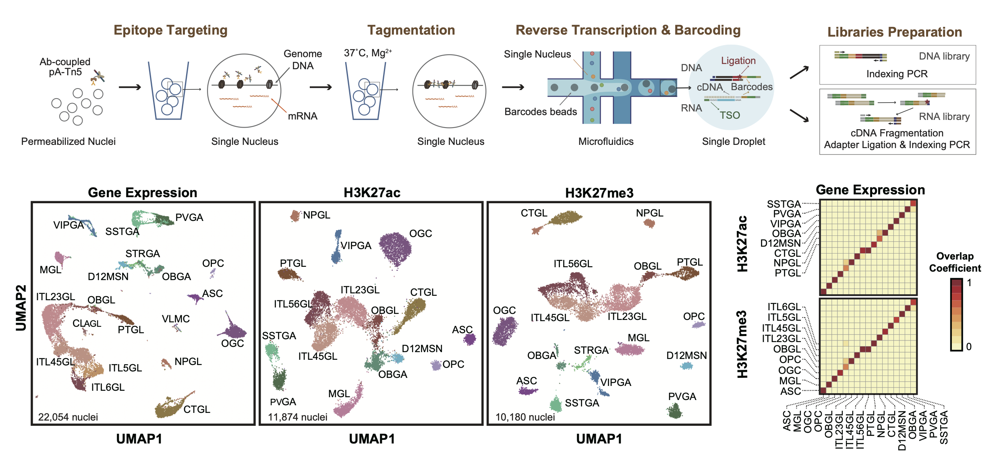

# Droplet-Paired-Tag
☕️ This repository contains experimental protocol and code to reproduce the results for publication: **A Fast and Broadly Accessible Method for Single-cell Joint Profiling of Histone Modification and Transcriptome**
Manuscript can be found here: [link]

## Abstract
We previously reported Paired-Tag, a combinatorial-indexing based method that can simultaneously map histone modifications and gene expression at single-cell resolution at scale. However, the lengthy procedure of Paired-Tag has hindered its general adoption in the community. To address this bottleneck, we develop a droplet-based Paired-Tag protocol that is faster and more accessible to the scientific community. Using cultured mammalian cells and primary brain tissues we demonstrate its superior performance at both identification of the candidate cis-regulatory elements and delineation of their potential target genes in each of the constituent cell types in a complex tissue. 

## [01.pre-process](https://github.com/Xieeeee/Droplet-Paired-Tag/tree/main/01.pre-process)
This directory contains scripts and analysis notebook for pre-processing (including mapping, FRiP, cells filtering) Droplet Paired-Tag histone modifications and RNA data. 

## [02.analysis](https://github.com/Xieeeee/Droplet-Paired-Tag/tree/main/02.analysis)
This directory contains scripts and analysis notebook for re-producing figures in our manuscript. 

## [03.protocol](https://github.com/Xieeeee/Droplet-Paired-Tag/tree/main/03.protocol)
This directory contains step-by-step protocol and oligos information for Droplet Paired-Tag (still under construction!). 
